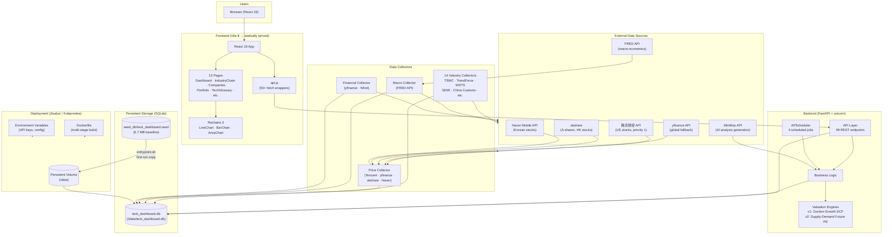

# Architecture Overview — AI Chip & Semiconductor Storage Dashboard



## Functional Areas

### 1. Frontend (React 19 + Vite 8)

**13 pages** organized into 4 navigation groups:

| Group | Pages | Purpose |
|---|---|---|
| Overview | Dashboard, Portfolio | Live prices, market snapshot, tracking |
| Panorama | IndustryChain, TechGlossary, Companies, InvestmentPlan | Supply-chain deep dive, tech stack encyclopedia |
| Intelligence | IndustryIntelligence (cross-section), JudgmentLog (sequence) | 85+ industry indicators, AI analysis, timeline |
| Data | CompanyData, IndustryData | Raw data browser |

All API calls route through `api.js` which wraps `fetch()` with JSON parsing.
Vite dev server proxies `/api` to `http://localhost:8002`.

### 2. Backend (FastAPI + SQLAlchemy + SQLite)

**59 REST endpoints** across 15 modules. Key modules:

| Module | File | Responsibility |
|---|---|---|
| `main.py` | 59 routes | All API endpoints (15 functional sections) |
| `price_data.py` | Multi-source price fetcher | Tencent → yfinance → akshare → Naver → cache |
| `scheduler.py` | APScheduler | 4 jobs: collect/6h, prices/15min, financials/12h, returns/4h |
| `valuation.py` | Gordon Growth DCF | Fair PE, implied growth rate, peer comparison |
| `valuation_v2.py` | Supply-Demand Future PE | Chain scores, growth adjustments, valuation signals |
| `ai_analysis.py` | MiniMax integration | One-line + triple-impact AI analysis |
| `backfill_3y_prices.py` | Historical price backfill | Bulk 3-yr + daily incremental backfill |

### 3. Data Model (SQLite, 24 tables)

Key entity clusters:

```
Company ──→ Product / ProductMetric
    ├──→ MarketData (time-series prices, per company)
    ├──→ Financial (per fiscal year: revenue, PE, margins)
    ├──→ CompanyChainLink ──→ IndustryChainLink
    ├──→ Follow (user watchlist, max 7)
    ├──→ Portfolio ──→ PortfolioHolding / PortfolioPerformance
    └──→ CompanyScore ──→ ScoringDimension

KeyIndicator ──→ IndicatorObservation (industry + macro time-series)

TimelineEvent ←── IndicatorObservation + JudgmentLog
```

### 4. Data Collection (5 Layers)

| Layer | Cadence | Sources | Tables |
|---|---|---|---|
| L0: Real-time prices | Every 15 min | Tencent, yfinance, Naver, akshare | StockInfoCache, PriceCache |
| L1: Industry indicators | Every 6/18 hr | 14 web scraping sources | IndicatorObservation |
| L2: Financial data | Every 7/19 hr | yfinance (revenue, PE, margins) | StockInfoCache, Financial |
| L3: Macro data | On-demand | FRED API | IndicatorObservation |
| L4: Historical backfill | One-time + daily incremental | Tencent K-line, yfinance | PriceCache → MarketData |

### 5. AI Analysis Pipeline

```
IndicatorObservation (new value with change_pct)
    → MiniMax API (model: MiniMax-M3)
    → industry_impact / chain_impact / company_impact
    → stored in IndicatorObservation.analysis fields
```

Triggered after each industry collection cycle (6:00 / 18:00) and via
`POST /api/industry/batch-analyze`.

### 6. Valuation Engines

| Model | Method | Input | Output |
|---|---|---|---|
| v1 (Gordon Growth) | Two-stage DCF | Discount rate, terminal growth, N years, China premium | Fair PE, fair market cap, upside %, implied growth rate |
| v2 (Supply-Demand Future PE) | Future earnings × future PE | Chain supply-demand score, company adjustments, peer group | Valuation signal (undervalued → overvalued), adjusted growth rate |

### 7. Deployment (Zeabur / Docker)

```
Docker multi-stage build:
  Stage 1: npm ci + npm run build (frontend)
  Stage 2: pip install + copy backend + copy dist/
  
Runtime:
  entrypoint.sh → cp seed → /data (first-run only)
              → uvicorn main:app --port 8080
              → init_scheduler() (APScheduler starts)
```

Persistent volume at `/data` preserves the SQLite database across redeploys.

### 8. Execution Flows

**Price refresh flow (every 15 min):**
```
refresh_follow_prices_15min()
  → db.query(Follow)
  → for each followed ticker: get_stock_info(ticker)
      → Tencent API → parse → StockInfoCache upsert
      └→ on failure: yfinance → StockInfoCache upsert
```

**Industry collection flow (every 6/18 hr):**
```
auto_collect_and_analyze()
  → collect_all(db)               # runs 20+ collectors
  → for each success → write IndicatorObservation
  → for each new obs → create TimelineEvent
  → batch_analyze_industry_impact()
      → MiniMax API → industry/chain/company impact
```

**Company refresh flow (every 7/19 hr):**
```
refresh_company_financials()
  → refresh_all_company_data(db)      # Tencent + yfinance
  → incremental_backfill_prices()      # fill price gaps
  → backfill_market_data()             # sync to MarketData
```

## Related Documentation

- [System Architecture](docs/explanation/architecture.md) — design principles and startup sequence
- [Data Pipeline](docs/explanation/data-pipeline.md) — end-to-end data flow across 5 layers
- [Data Sources](docs/explanation/data-sources.md) — external API integration details
- [Valuation Methodology](docs/explanation/valuation.md) — v1 and v2 model mathematics
- [API Reference](docs/reference/api.md) — all 59 endpoints
- [Database Reference](docs/reference/database.md) — 24 table schemas
- [Frontend Reference](docs/reference/frontend.md) — component tree and routing
- [Deployment Guide](docs/how-to/deploy.md) — Zeabur operations
- [Configuration Reference](docs/reference/configuration.md) — environment variables
